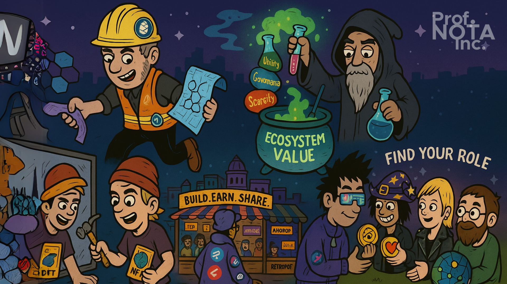

# ⁉️ Bagian 00

🎯 **Tujuan Materi**

Memberikan pemahaman tentang:

* Bagaimana blockchain bisa menjadi sumber nilai ekonomi.
* Peran dan peluang finansial dari berbagai aktor: validator, developer, builder, investor, dan komunitas.
* Strategi konkret untuk membangun atau bergabung dalam ekosistem blockchain dengan nilai tambah ekonomi yang jelas.

<figure><figcaption>
Blockchain sebagai Model Bisnis dan Ekosistem Ekonomi Baru.
</figcaption></figure>

***

## 📚 Struktur Materi

### **1. Pemahaman Dasar: Blockchain sebagai Infrastruktur Ekonomi**

* Apa itu ekonomi terdesentralisasi?
* Perbedaan ekonomi Web2 vs Web3
* Bagaimana protokol blockchain menciptakan “public goods” tapi juga bisa menghasilkan keuntungan?

### **2. Peran Ekonomi dalam Ekosistem Blockchain**

#### **🔸 Validator / Node Operator**

* Fungsi teknis dan ekonominya
* Biaya vs potensi pemasukan (staking reward, fee, dsb)
* Contoh: Ethereum validator, Cosmos validator

#### **🔸 Pengembang Aplikasi On-Chain**

* Monetisasi aplikasi berbasis smart contract
* Revenue model: fee, premium service, tokenomics
* Kasus: Uniswap, Lens Protocol, Zora

#### **🔸 Pembuat Protokol (Protocol Founder)**

* Token design dan vesting sebagai insentif jangka panjang
* Governance control dan value accrual
* Model DAO untuk sustainable funding

#### **🔸 Community Leader / Ekosistem Builder**

* Peran membangun awareness dan trust
* Strategi komunitas = strategi keberlanjutan
* Benefit: retroactive airdrops, funding dari treasury, reputasi

#### **🔸 Kontributor atau Freelancer Web3**

* Model kerja di ekosistem open-source
* Platform bounty (Gitcoin, Dework, Questbook)

### **3. Studi Kasus Model Bisnis Blockchain**

* **Ethereum:** Layer 1 dengan fee-based revenue
* **Solana:** Ekosistem builder + performance scaling
* **Arbitrum:** Airdrop dan DAO treasury governance
* **Polygon:** Business partnership + zk-tech
* **Optimism:** RetroPGF sebagai insentif builder

### **4. Model Insentif dan Tokenomics**

* Bagaimana token menjadi alat distribusi nilai?
* Perbedaan antara speculative token vs utility token
* Role of staking, burning, and governance

### **5. Menyusun Strategi Bisnis Web3**

* Membangun aplikasi: dari ide ke revenue
* Mendesain token: insentif, alokasi, dan keberlanjutan
* Kolaborasi dengan DAO, grant, dan community

### **6. Diskusi & Simulasi**

* Simulasi: Merancang sebuah model bisnis berbasis blockchain (dengan peran berbeda-beda per kelompok)
* Tugas: Buat pitch pendek tentang bagaimana “kamu” bisa mendapatkan value dalam ekosistem Web3

<figure><figcaption>
Struktur Materi Model Bisnis Blockchain.
</figcaption></figure>

***

## 📦 Output Materi

* Setiap peserta bisa menyebutkan 1-2 peran potensial mereka di Web3
* Setiap peserta bisa menyusun draft sederhana model bisnis mereka di dalam blockchain ecosystem
* Peserta paham bahwa blockchain bukan hanya teknologi, tapi sistem ekonomi yang dapat dimasuki dengan berbagai cara

***

P.S. Read this document freely for information and guidance. Do not redistribute or restate—no quotes, summaries, paraphrases, or derivatives—without prior written permission from [**Prof. NOTA**](https://nota.endhonesa.com/). Sharing the link is allowed. So, share the link, not the text. Do not discuss or re-tell the contents in any form—written, spoken, or recorded—without prior written permission.

***
