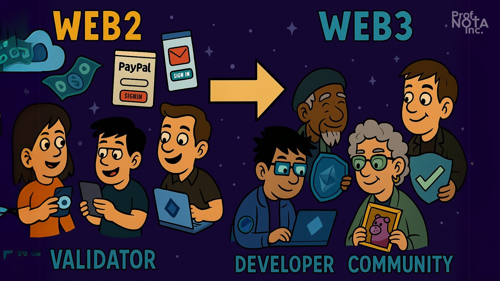
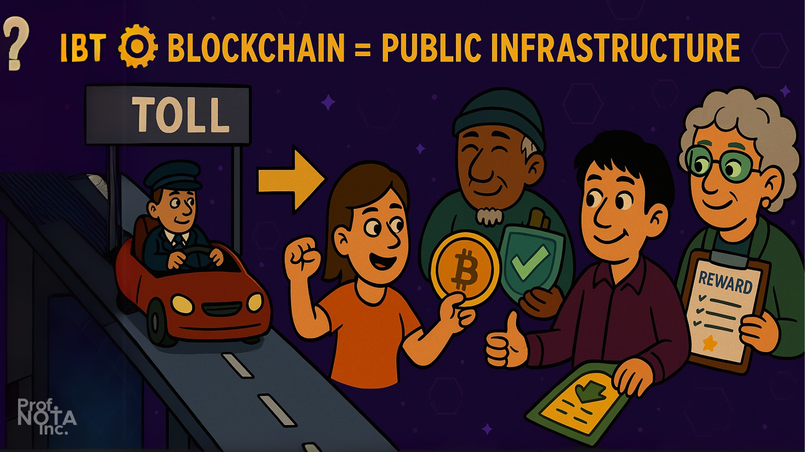
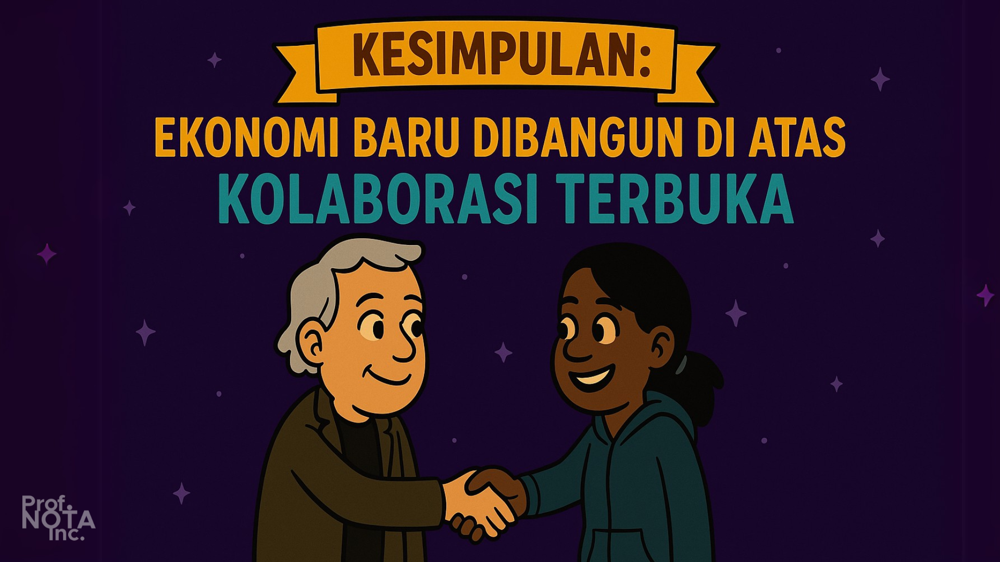

# ☕ Bagian 01

> _“Jangan buru-buru berpikir tentang uang. Pahami dulu bagaimana nilai lahir dari kepercayaan dan sistem yang transparan.”_
>
> – **Prof. NOTA**

Di awal kemunculannya, blockchain sering disalahpahami sebagai sekadar alat tukar digital: Bitcoin untuk membeli kopi, Ethereum untuk transaksi NFT, dan seterusnya.

Tapi mereka yang berpikir seperti itu, belum menggali ke dalam. Karena sejatinya, blockchain bukan hanya soal transaksi—tapi tentang **infrastruktur ekonomi baru**, sebuah landasan yang mengubah bagaimana nilai diciptakan, disebarkan, dan dijaga bersama.

<figure><figcaption>
Blockchain sebagai Infrastruktur Ekonomi.
</figcaption></figure>

***

## 🌐 Ekonomi Web2 vs Web3

Mari kita buka perbedaan paling mendasar. Di dunia Web2—yang kita jalani sehari-hari lewat media sosial, platform belanja, dan layanan streaming—semua nilai terpusat.

* Data? Disimpan oleh raksasa digital.
* Identitas? Bergantung pada login Gmail.
* Uang? Mengalir melalui bank, PayPal, dan entitas keuangan lainnya.

Nilai tercipta melalui interaksi massal, tapi hasilnya **tidak adil**: hanya sedikit yang di atas piramida yang menikmati manfaat sesungguhnya.

### Masuklah Web3

Di sinilah blockchain menawarkan sebuah tawaran radikal: _"bagaimana jika infrastruktur itu bisa dibangun bersama, dimiliki bersama, dan dikelola bersama?"_

Setiap aplikasi Web3 bukan hanya tempat untuk menggunakan teknologi, tapi **peluang untuk menjadi bagian dari infrastruktur itu sendiri**. Entah sebagai validator yang menjaga jaringan, pengembang yang membangun di atasnya, hingga komunitas yang mengarahkan arah protokol. Semuanya mendapatkan bagian nilai dari sistem yang mereka bantu hidupkan.

<figure><figcaption>
Ekonomi Web2 vs Web3.
</figcaption></figure>

***

## ⚙️ Blockchain = Public Infrastructure

Bayangkan jalan tol yang dibangun oleh negara. Ia digunakan oleh semua orang, tapi dikelola oleh segelintir. Blockchain mengguncang logika itu: jalan tol ini dibangun oleh komunitas, dikelola oleh komunitas, dan reward-nya pun dikembalikan kepada komunitas.

Dengan kata lain, blockchain memungkinkan siapa pun untuk:

* **Ikut serta dalam infrastruktur**, bukan sekadar jadi pengguna.
* **Menerima insentif secara langsung**, bukan menunggu subsidi atau bonus dari “pusat”.
* **Bersama-sama menjaga nilai**, lewat sistem transparan, tidak bisa dimanipulasi, dan bisa diaudit publik.

Inilah mengapa blockchain disebut sebagai _ekonomi publik terdesentralisasi_. Ia bukan hanya "uang digital", tapi **desain ulang terhadap bagaimana masyarakat bisa membangun dan menikmati ekonomi digital bersama-sama.**

<figure><figcaption>
Blockchain = Public Infrastructure
</figcaption></figure>

***

## 💡 Kesimpulan Bagian Ini

> _“Jika ekonomi lama dibangun di atas kepemilikan tertutup, maka ekonomi baru dibangun di atas kolaborasi terbuka.”_
>
> – **Prof. NOTA**

Blockchain adalah kesempatan untuk ikut serta dalam infrastruktur ekonomi yang baru. Tapi untuk bisa memanfaatkannya, kita harus memahami **peran-peran yang tersedia di dalamnya** — peran yang bukan hanya memberi manfaat pribadi, tapi juga memperkuat ekosistem tempat kita hidup digital.

<figure><figcaption>
<em>Ekonomi baru dibangun di atas kolaborasi terbuka.</em>
</figcaption></figure>

***

### **Prof. NOTA bertanya pada kalian semua:**

> _“Apakah kalian siap menjadi bagian dari sistem yang tidak hanya memberi nilai, tapi mengajarkan makna kepemilikan bersama?”_
>
> – **Prof. NOTA**

***
