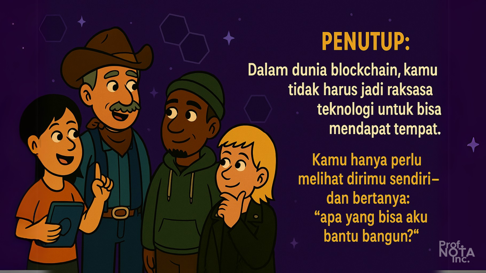

# 🔏 Bagian 02

> _“Blockchain bukan hanya menciptakan teknologi baru—ia menciptakan peran-peran baru yang belum pernah ada di sejarah manusia.”_
>
> – **Prof. NOTA**

Jika Web3 adalah dunia baru, maka seperti dunia mana pun, ia memiliki ekosistemnya sendiri. Di dalamnya ada peran-peran yang saling terhubung, saling memberi nilai, dan saling memperkuat.

Bayangkan sebuah kota yang dibangun bersama:

* Ada yang menjaga keamanannya (validator),
* Ada yang membangun rumah-rumah (developer),
* Ada yang memikirkan sistem sosial dan ekonominya (protocol founder),
* Ada yang menghidupkan suasananya (community leader),
* Ada pula yang datang dan berkontribusi secara bebas (kontributor).

Mari kita uraikan satu per satu — agar siapa pun bisa melihat dan berpikir: **“saya bisa jadi yang mana...”**

<figure><figcaption>
Peran Ekonomi dalam Ekosistem Blockchain.
</figcaption></figure>

***

## 🔸 Validator / Node Operator

### **"Penjaga infrastruktur yang tidak terlihat, tapi vital."**

Validator adalah tulang punggung dari jaringan blockchain. Mereka menjalankan node—komputer yang terus menyimpan dan memvalidasi transaksi. Tanpa mereka, blockchain hanya jadi kumpulan data mati.

### **Insentif Finansial:**

* Mendapatkan **staking reward** dari blok yang berhasil divalidasi.
* Potensi mendapatkan **biaya transaksi (gas fees)** dari pengguna.
* Di jaringan tertentu, bisa menerima **infrastruktur grant atau insentif early validator.**

### **Biaya & Risiko:**

* Perlu perangkat keras (server) dan koneksi stabil).
* Risiko slashing (hukuman) jika offline atau tidak jujur.
* Perlu pemahaman teknis dan tanggung jawab tinggi.

Contoh sukses: validator Ethereum, Solana, Cosmos.

Beberapa komunitas di Indonesia sudah menjalankan node, bahkan sebagai kooperasi.

<figure><figcaption>
Validator / Node Operator
</figcaption></figure>

***

## 🔸 Pengembang Aplikasi On-Chain

### **"Arsitek digital yang membangun rumah-rumah baru di atas blockchain."**

Developer adalah mereka yang menulis kode smart contract dan membangun aplikasi terdesentralisasi (dApps). Ini bisa berupa marketplace, dompet, DAO, game, hingga aplikasi sosial.

### **Model Bisnis Umum:**

* **Fee model**: pengguna membayar biaya transaksi kecil.
* **Freemium model**: fitur dasar gratis, fitur premium berbayar.
* **Tokenomics**: menggunakan token internal untuk insentif dan akses.
* **Revenue sharing** dengan protokol induk.

### Contoh Nyata:

* **Uniswap** mengenakan fee pada setiap pertukaran token.
* **Zora** membagi pendapatan dari NFT secara otomatis.
* **Mirror** membayar penulis lewat model crowdfund token.

### **Kelebihan:**

* Bisa dimulai dari mana saja.
* Open source = banyak bahan belajar dan kontribusi.
* Berpeluang mendapatkan **grant atau hackathon prize.**

<figure><figcaption>
Pengembang Aplikasi On-Chain
</figcaption></figure>

***

## 🔸 Pembuat Protokol / Protocol Founder

### **"Pemimpi sistem baru—dan pembuat aturan mainnya."**

Menjadi pembuat protokol artinya membangun fondasi tempat aplikasi berjalan. Kamu bukan cuma bikin aplikasi, tapi bikin “tanahnya”—sebuah Layer 1, Layer 2, atau protokol layanan (DeFi, Storage, Social, dsb).

### **Manfaat Finansial:**

* **Token allocation** (team, advisor, early builders)
* **Fundraising dari VC atau DAO Treasury**
* **Revenue protocol fees**

### Tapi ini bukan jalan yang mudah. Ia memerlukan:

* Visi jangka panjang
* Tim yang kuat dan teruji
* Mekanisme governance dan tokenomics yang berkelanjutan

Kamu harus membangun sesuatu **yang bukan hanya jalan**, tapi terus berkembang bersama komunitas.

<figure><figcaption>
Pembuat Protokol / Protocol Founder
</figcaption></figure>

***

## 🔸 Community Leader / Ekosistem Builder

### **"Kamu tidak menulis kode, tapi kamu menulis sejarah."**

Banyak yang berpikir bahwa blockchain hanya untuk teknolog. Salah! Web3 membutuhkan **penggerak komunitas**: orang-orang yang menyebarkan semangat, menjelaskan nilai, dan menjaga ekosistem tetap hidup.

### **Insentif:**

* **Airdrop retroaktif**, seperti Optimism dan Arbitrum.
* **Treasury grant** untuk inisiatif edukasi dan ekspansi.
* **Reputasi dan kredibilitas** sebagai pemimpin komunitas.

Tugasmu bukan hanya “ngonten” — tapi membangun relasi, menghidupkan diskusi, dan membentuk narasi besar.

### Contoh:

* Developer Relations di ZK-rollup.
* Community Champion di Farcaster.
* DAO Steward yang dipilih melalui governance.

<figure><figcaption>
Community Leader / Ekosistem Builder
</figcaption></figure>

***

## 🔸 Kontributor Terbuka / Freelancer Web3

### **"Yang bebas memilih proyek, dan dibayar karena kontribusi nyata."**

Web3 membuka peluang baru: siapa pun, dari mana pun, bisa langsung **berkontribusi dan dibayar**, tanpa perlu melamar kerja.

### **Caranya:**

* Ikut bounty di [Gitcoin](https://gitcoin.co/).
* Menyelesaikan task di [Dework](https://dework.xyz/) atau [Wonderverse](https://www.wonderverse.xyz/).
* Apply grant kecil untuk ide lokal.

### Kontributor ini bisa berupa:

* Developer
* Desainer
* Penulis
* Penerjemah
* Fasilitator komunitas

Dan kabar baiknya: mereka dibayar **langsung dalam token**, stablecoin, atau bahkan NFT reward.

<figure><figcaption>
Kontributor Terbuka / Freelancer Web3
</figcaption></figure>

***

## 🌱 Penutup Bagian Ini

> _“Dalam dunia blockchain, kamu tidak harus jadi raksasa teknologi untuk bisa mendapat tempat. Kamu hanya perlu melihat dirimu sendiri—dan bertanya: ‘apa yang bisa aku bantu bangun?’”_
>
> – **Prof. NOTA**

Dunia Web3 bukan tentang siapa yang paling cepat, tapi siapa yang **mau berbuat nyata dan konsisten.**

* Setiap peran memiliki tempatnya.
* Setiap kontribusi punya cara untuk dihargai.
* Dan kamu bisa memilih peranmu sendiri—tanpa izin siapa pun.

<figure><figcaption>
<em>Apa yang bisa aku bantu bangun di dunia blockchain?</em>
</figcaption></figure>

***
