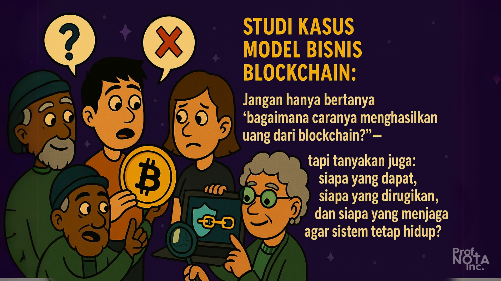
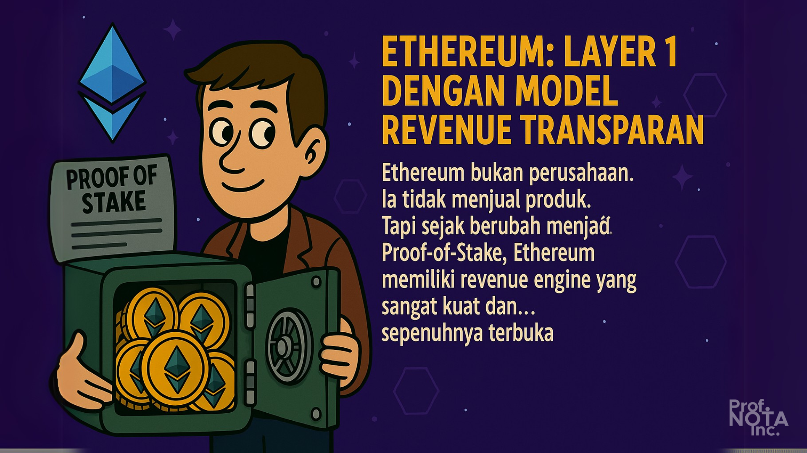
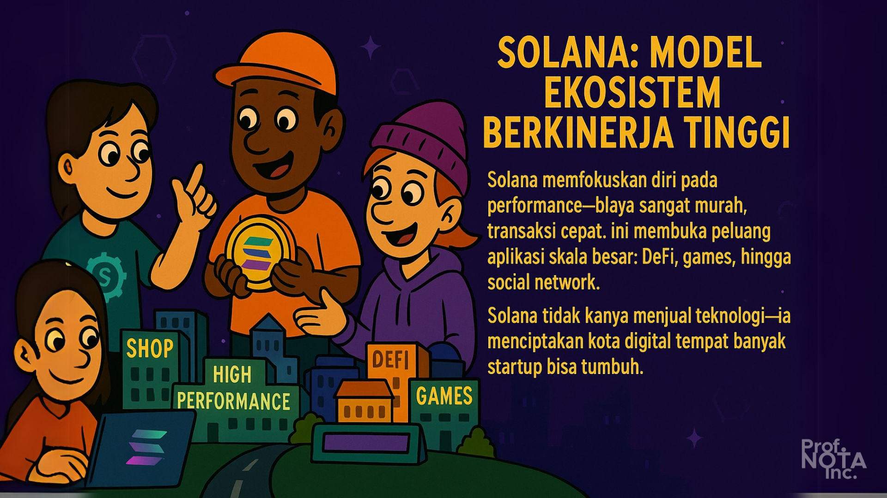
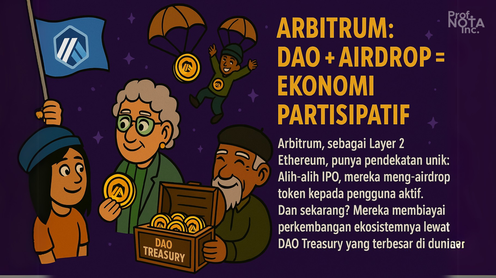
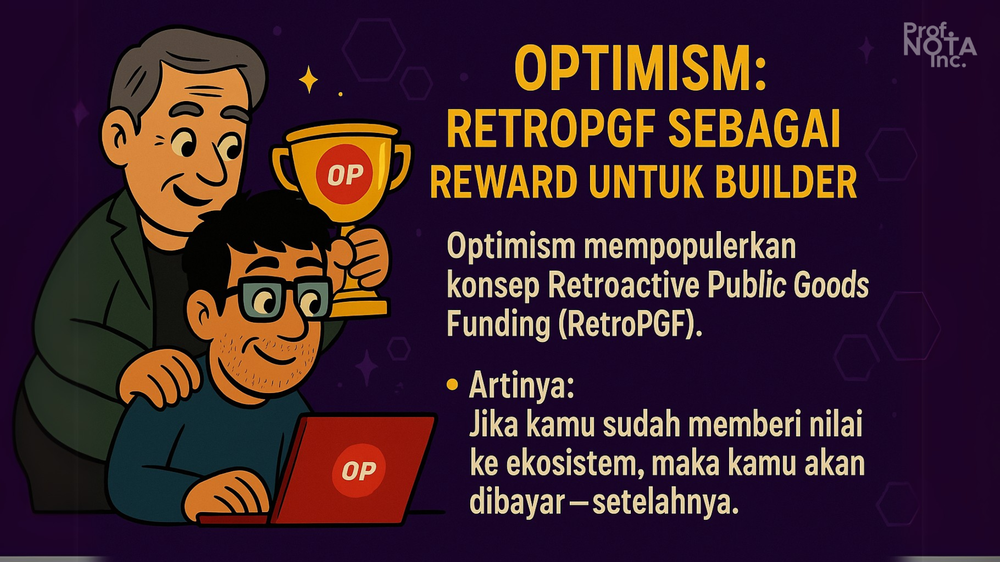
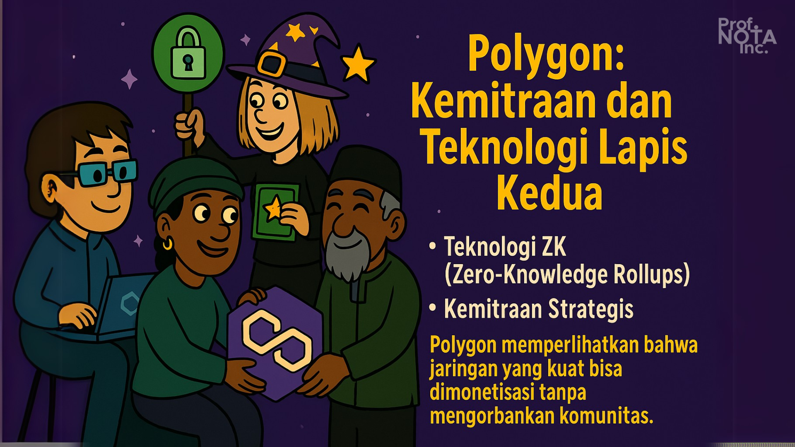
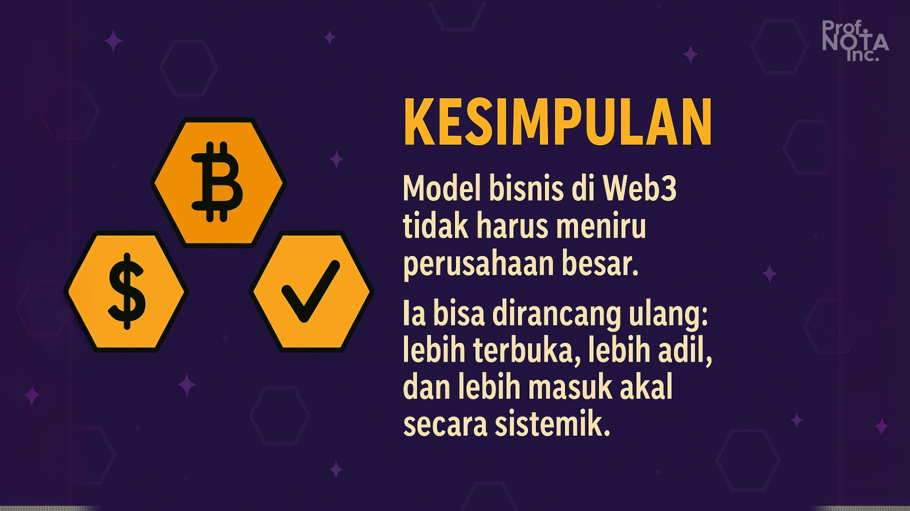

# 📜 Bagian 03

> “_Jangan hanya bertanya ‘bagaimana caranya menghasilkan uang dari blockchain?’—tapi tanyakan juga: siapa yang dapat, siapa yang dirugikan, dan siapa yang menjaga agar sistem tetap hidup?”_
>
> – **Prof. NOTA**

Di dunia Web2, studi kasus biasanya berfokus pada perusahaan: siapa investornya, berapa valuasinya, bagaimana strategi monetisasinya.

Tapi di Web3, kita perlu berpikir dalam **layer dan protokol**, bukan hanya perusahaan. Sebab yang menghasilkan nilai adalah **jaringan itu sendiri**—dan siapa saja yang membangun di atasnya bisa mendapat bagiannya.

Berikut ini adalah beberapa **kasus nyata model bisnis Web3** yang bisa kamu pelajari dan, mungkin suatu hari, kamu replikasi — atau bahkan kamu kalahkan.

<figure><figcaption>
Studi Kasus Model Bisnis Blockchain.
</figcaption></figure>

***

## ⚙️ Ethereum: Layer 1 dengan Model Revenue Transparan

Ethereum bukan perusahaan. Ia tidak menjual produk. Tapi sejak berubah menjadi **Proof-of-Stake**, Ethereum memiliki **revenue engine** yang sangat kuat dan... sepenuhnya terbuka.

### **Sumber pendapatan:**

* Gas fee dari transaksi
* MEV (Miner Extractable Value) tips
* Burn mekanisme (EIP-1559) yang memperkuat nilai ETH

### **Yang mendapat keuntungan:**

* Validator (dari staking reward dan fee)
* Pemegang ETH (karena supply makin terbatas)
* Developer (membangun dApps)
* DAO dan komunitas (melalui grant dan funding)

### **Nilai plus:**

* Revenue bersifat _sustainable_ dan _non-speculative_
* Transparan: bisa dilihat di [ultrasound.money](https://ultrasound.money)

<figure><figcaption>
Ethereum: Layer 1 dengan Model Revenue Transparan.
</figcaption></figure>

***

## ⚡ Solana: Model Ekosistem Berkinerja Tinggi

Solana memfokuskan diri pada **performance**—biaya sangat murah, transaksi cepat. Ini membuka peluang aplikasi skala besar: DeFi, games, hingga social network.

### **Model Bisnis:**

* Protokol mengambil fee kecil dari transaksi.
* Menarik developer untuk membangun dan membawa user (growth loop).
* Memfasilitasi ekosistem venture: investor, builder, komunitas.

### **Contoh Penerapan:**

* Phantom Wallet → monetisasi lewat NFT & layanan premium.
* Jupiter Aggregator → mengambil fee dari swap & routing.
* Helium (IoT) bermigrasi ke Solana → menawarkan _network effect._

Solana _tidak hanya menjual teknologi_—ia menciptakan kota digital tempat banyak startup bisa tumbuh.

<figure><figcaption>
Solana: Model Ekosistem Berkinerja Tinggi.
</figcaption></figure>

***

## 🔗 Arbitrum: DAO + Airdrop = Ekonomi Partisipatif

Arbitrum, sebagai Layer 2 Ethereum, punya pendekatan unik:

Alih-alih IPO, mereka **meng-airdrop** token kepada pengguna aktif. Dan sekarang? Mereka membiayai perkembangan ekosistemnya lewat **DAO Treasury** yang terbesar di dunia.

### **Modelnya:**

* Tidak ada pemilik tunggal.
* Governance dipegang oleh komunitas.
* Developer, kreator, dan komunitas bisa _mengajukan proposal dana._

### **Efeknya:**

* Partisipasi tinggi: semua merasa punya andil.
* Dana publik untuk inisiatif publik: edukasi, event, fitur, tooling.

Inilah model **ekonomi gotong royong**, versi digital.

<figure><figcaption>
Arbitrum: DAO + Airdrop = Ekonomi Partisipatif
</figcaption></figure>

***

## ♻️ Optimism: RetroPGF sebagai Reward untuk Builder

Optimism mempopulerkan konsep **Retroactive Public Goods Funding (RetroPGF)**.

Artinya?

> _“Jika kamu sudah memberi nilai ke ekosistem, maka kamu akan dibayar—setelahnya.”_

**Sumber dana:** treasury dari token OP

### **Yang mendapat reward:**

* Developer open-source
* Penulis dokumentasi
* Komunitas edukasi
* Kreator tooling & UI

### **Dampaknya:**

* Mendorong kontribusi ikhlas yang tetap dihargai.
* Merangsang ekosistem untuk terus _bernilai_, bukan hanya _viral._

Optimism mengubah logika startup: bukan siapa yang cepat viral, tapi siapa yang benar-benar _membangun nilai bersama_.

<figure><figcaption>
Optimism: RetroPGF sebagai Reward untuk Builder.
</figcaption></figure>

***

## 🧬 Polygon: Kemitraan dan Teknologi Lapis Kedua

Polygon sukses mengembangkan ekosistem dengan dua kekuatan:

1. **Teknologi ZK (Zero-Knowledge Rollups)** → masa depan skalabilitas.
2. **Kemitraan Strategis** → Starbucks, Disney, Nike, dsb.

### **Model bisnis:**

* B2B onboarding (web2 → web3)
* Layanan khusus untuk enterprise (Polygon ID, Polygon Studio)
* Biaya rendah untuk developer

Polygon memperlihatkan bahwa **jaringan yang kuat bisa dimonetisasi** tanpa mengorbankan komunitas.

<figure><figcaption>
Polygon: Kemitraan dan Teknologi Lapis Kedua.
</figcaption></figure>

***

## 💡 Kesimpulan Bagian Ini

> _“Model bisnis di Web3 tidak harus meniru perusahaan besar. Ia bisa dirancang ulang: lebih terbuka, lebih adil, dan lebih masuk akal secara sistemik.”_

Studi-studi di atas menunjukkan satu benang merah:

**Ekosistem Web3 memberi nilai pada kontribusi nyata, bukan hanya modal uang.** Dan itu artinya — siapa pun bisa terlibat.

### Prof. NOTA menyimpulkan:

> “_Kita tidak harus menciptakan blockchain baru. Cukup pahami model bisnisnya, dan tanamlah diri kita di titik yang tepat dalam rantai nilai itu. Maka kita akan tumbuh bersama sistem._”
>
> – **Prof. NOTA**

<figure><figcaption>
<strong>Ekosistem Web3 memberi nilai pada kontribusi nyata, bukan hanya modal uang.</strong>
</figcaption></figure>

***
