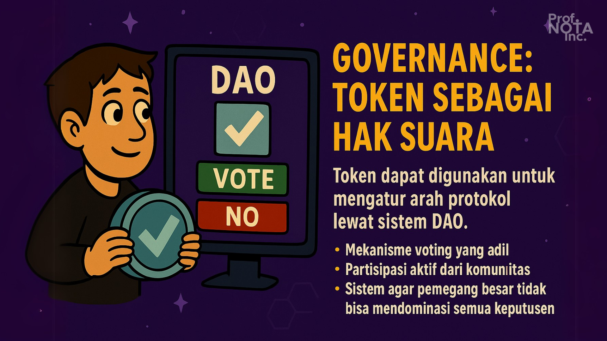
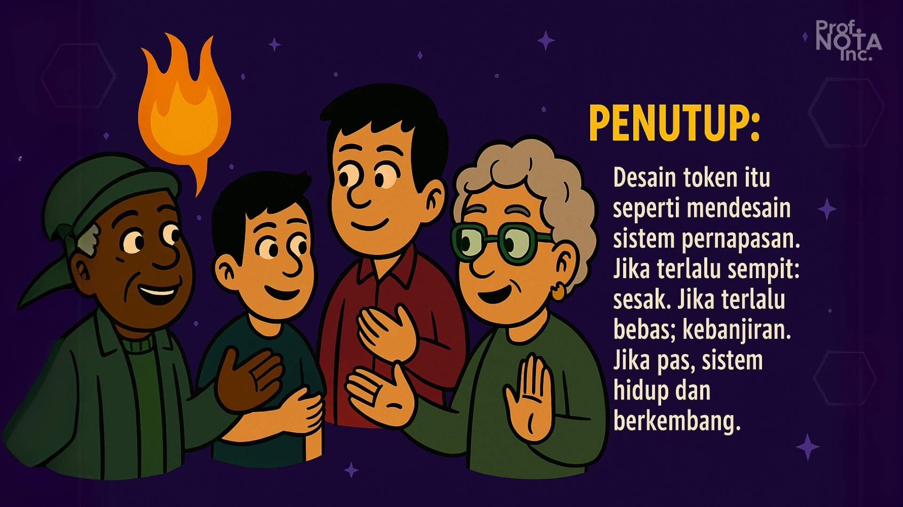

# 💡 Bagian 04

> _“Token bukan uang ajaib. Ia adalah kontrak sosial yang dikemas dalam angka.”_
>
> – **Prof. NOTA**

Setiap kali kamu melihat sebuah proyek blockchain membagikan token, tanyakan ini:

* Untuk apa token ini ada?
* Siapa yang akan menyimpannya?
* Siapa yang akan membuangnya?
* Dan… siapa yang diam-diam mengendalikannya?

Token bukan hanya soal angka di layar. Token adalah **alat desain ekonomi.** Dengan token, kita bisa:

* Memberi insentif kepada kontributor
* Mengatur hak suara (governance)
* Mengelola pasokan dan permintaan
* Menciptakan loyalitas, atau justru spekulasi

Mari kita pecah menjadi beberapa prinsip inti.

<figure><figcaption>
Model Insentif dan Tokenomics.
</figcaption></figure>

***

## ⚖️ Fungsi Token: Apa Tujuan Nyatanya?

Token yang baik selalu **punya fungsi nyata.** Kalau tidak, ia hanyalah alat spekulasi tanpa akar.

### Fungsi umum token:

* 🔐 **Akses:** token digunakan untuk membuka fitur tertentu.
* 🗳️ **Voting:** token memberi hak suara dalam DAO atau protokol.
* 💰 **Insentif:** token diberikan sebagai reward (staking, kontribusi).
* 💼 **Representasi nilai:** token mewakili bagian dari protokol (revenue-sharing, profit-sharing).

#### 🔁 Banyak proyek memakai kombinasi fungsi. Tapi hati-hati:

> _“Semakin banyak fungsi tokenmu, semakin rumit pula tanggung jawabmu menjaganya.”_
>
> – **Prof. NOTA**

<figure><figcaption>
Fungsi Token: Apa Tujuan Nyatanya?
</figcaption></figure>

***

## 🪞 Token Supply & Distribusi

Supply token bukan hanya soal angka, tapi **soal kepercayaan.**

Distribusi menentukan apakah proyekmu terlihat _merakyat_, _adil_, atau justru _feodal dalam bungkus digital_.

### **Hal-hal yang wajib ditentukan sejak awal:**

* **Total supply:** berapa banyak token akan ada? Fixed atau inflationary?
* **Allocation:** siapa mendapat berapa? (team, investor, community, airdrop, treasury)
* **Vesting schedule:** kapan token bisa dicairkan?

#### 🔐 Contoh buruk:

* Team memegang 50% supply, bisa jual kapan saja.
* Investor early unlock sebelum produk matang.

#### 💡 Prinsip **Prof. NOTA**:

> _“Distribusikan kepercayaan, bukan dominasi.”_
>
> – **Prof. NOTA**

<figure><figcaption>
Token Supply &#x26; Distribusi
</figcaption></figure>

***

## 🧲 Mekanisme Insentif

Insentif adalah **pancingan awal**. Tapi juga harus jadi **jaring sosial** yang membuat pengguna tetap tinggal.

### **Jenis insentif:**

* ✅ **Proof of Participation:** reward karena hadir (event, vote, kontribusi).
* 🔁 **Staking Rewards:** reward karena mengunci token.
* 🧠 **Retroactive Rewards:** hadiah untuk kontribusi masa lalu.
* 🧩 **Liquidity Mining:** reward karena bantu pasar.

#### 🎯 Tujuannya bukan hanya memberi “uang gratis” tapi:

* Mendorong partisipasi
* Menciptakan loyalitas
* Mendistribusikan token secara organik

Tapi hati-hati: **insentif yang salah justru menarik “penambang insentif”—mereka datang hanya untuk mengambil, lalu pergi.**

<figure><figcaption>
Mekanisme Insentif
</figcaption></figure>

***

## 🔥 Burning & Deflasi

Beberapa protokol membakar token dari fee transaksi atau penalti.

### Tujuannya:

* Mengurangi supply
* Meningkatkan kelangkaan
* Menjaga harga tetap sehat

### Contoh:

* Ethereum membakar sebagian ETH dari gas fee (EIP-1559).
* BNB rutin melakukan burn kuartalan dari pendapatan exchange.

#### 📉 Tapi ingat, burn hanya efektif jika:

1. Transaksinya aktif
2. Ada permintaan riil untuk token

Kalau tidak, burn hanyalah ilusi kontrol.

<figure><figcaption>
Burning &#x26; Deflasi
</figcaption></figure>

***

## 🗳️ Governance: Token Sebagai Hak Suara

Token dapat digunakan untuk **mengatur arah protokol** lewat sistem DAO.

Namun governance yang sehat membutuhkan:

* Mekanisme voting yang adil (1 token = 1 suara? Quadratic voting?)
* Partisipasi aktif dari komunitas.
* Sistem agar pemegang besar tidak bisa mendominasi semua keputusan.

Jika tidak hati-hati, DAO bisa berubah jadi **oligarki token**—di mana keputusan penting hanya diambil oleh whale.

Solusinya?

* Voting delay
* Delegation system
* Kategori proposal (teknis vs strategis)

<figure><figcaption>
Governance: Token Sebagai Hak Suara
</figcaption></figure>

***

## 📚 Studi Ringkas:

| Protokol     | Token Utility          | Model Insentif             | Governance                     |
| ------------ | ---------------------- | -------------------------- | ------------------------------ |
| **Uniswap**  | Fee rebate, LP token   | Liquidity mining (dulu)    | Token voting via Snapshot      |
| **Arbitrum** | Governance token       | Airdrop + proposal funding | On-chain + Security Council    |
| **Optimism** | Retro funding          | RetroPGF                   | Collective intelligence voting |
| **Zora**     | Mint & curation reward | Creator revenue share      | Protocol-owned upgrades        |

<figure><figcaption>
Studi Ringkas
</figcaption></figure>

***

## 🧬 Penutup Bagian Ini

> _“Desain token itu seperti mendesain sistem pernapasan. Jika terlalu sempit: sesak. Jika terlalu bebas: kebanjiran. Jika pas, sistem hidup dan berkembang.”_
>
> – **Prof. NOTA**

Tokenomics adalah seni menyatukan: nilai, perilaku, dan kepercayaan.

Dan hanya dengan token yang benar-benar hidup—sebuah komunitas bisa bertahan dalam waktu yang panjang.

<figure><figcaption>
<em>Desain token itu seperti mendesain sistem pernapasan.</em>
</figcaption></figure>

***
