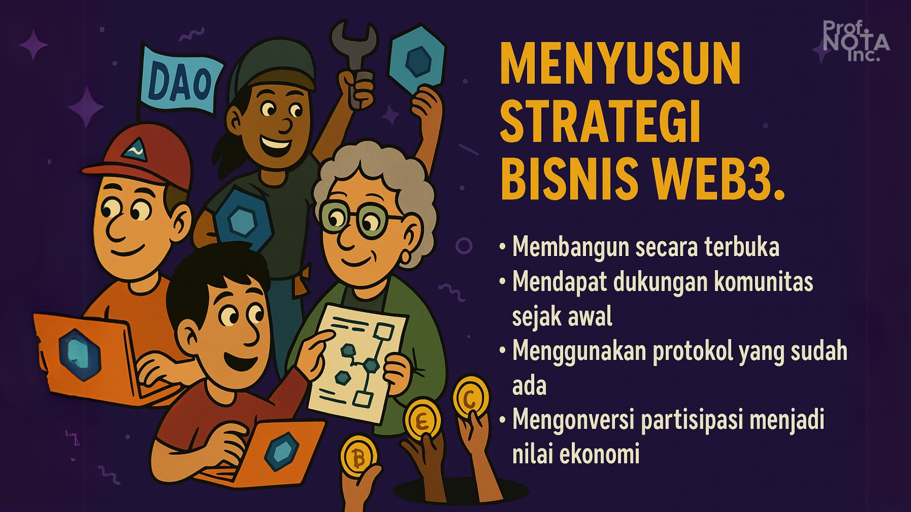
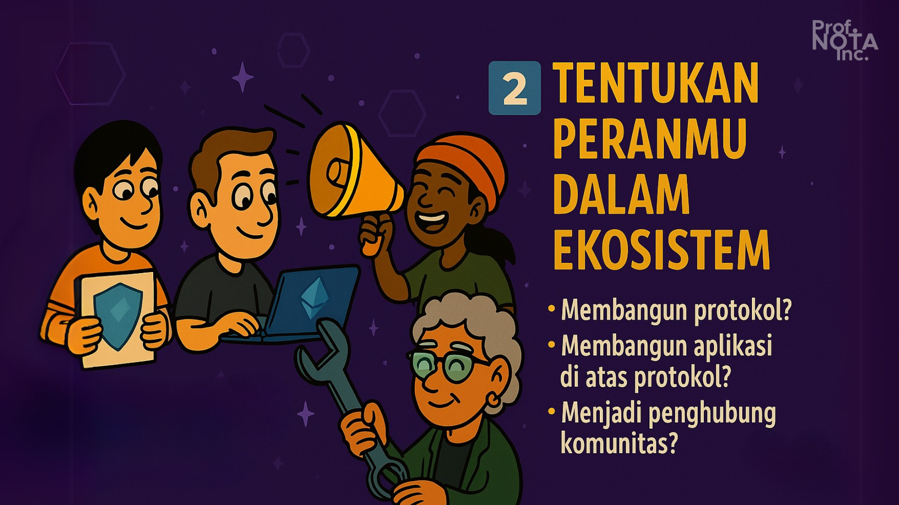
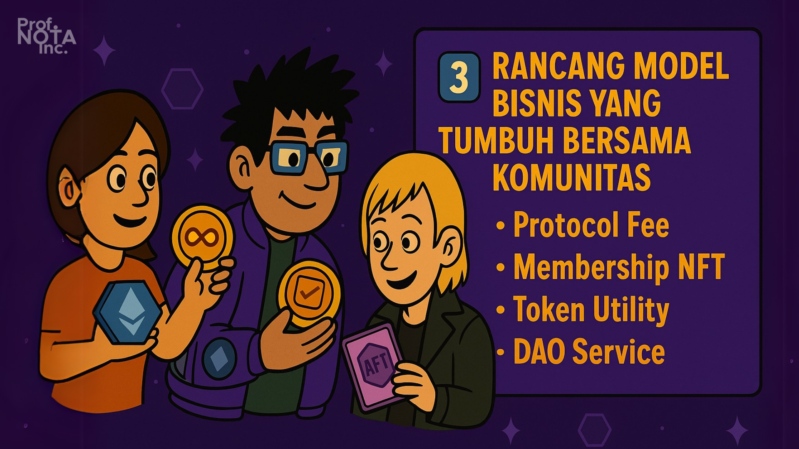
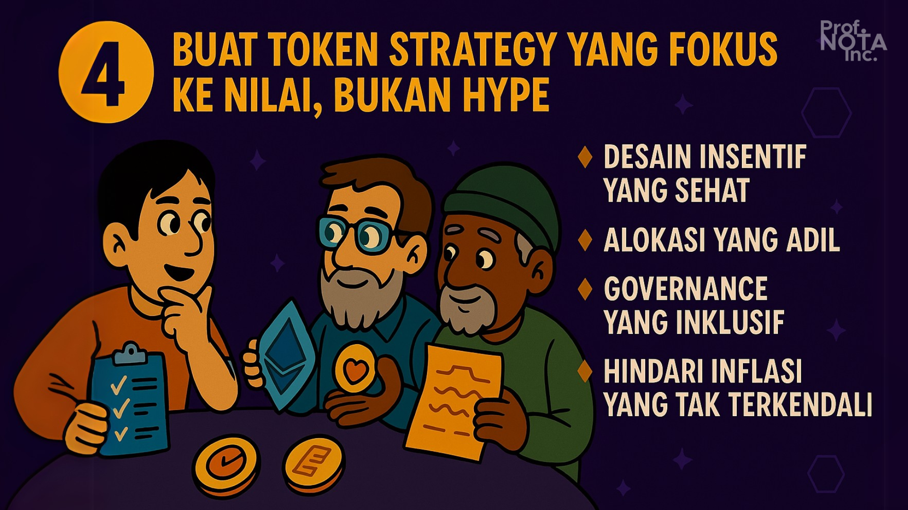
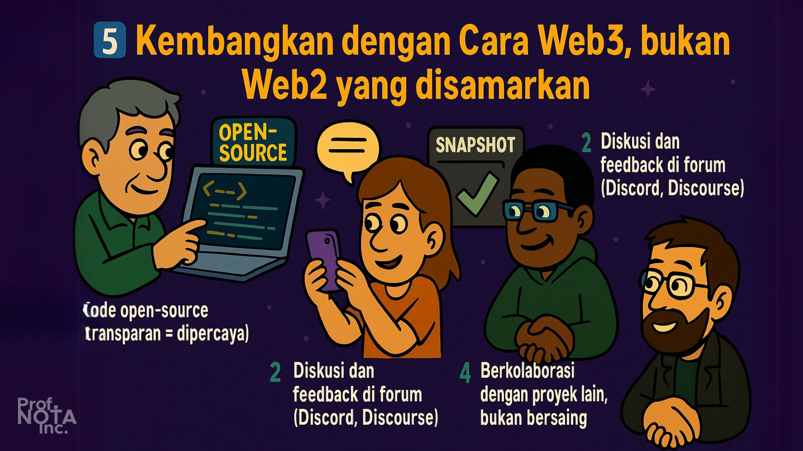
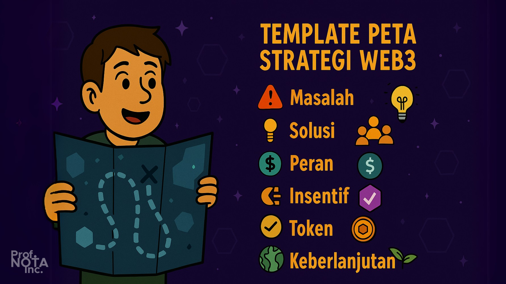
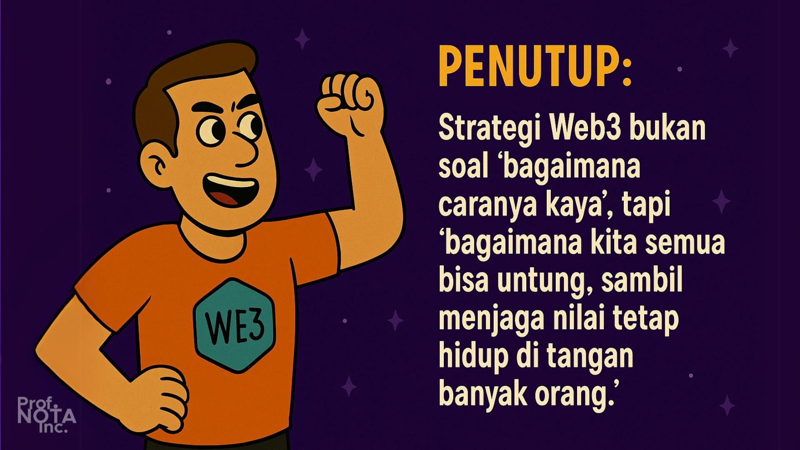

# 🧑‍🌾 Bagian 05

> _“Di dunia Web2, kamu membangun produk dan menjualnya ke user. Di Web3, kamu membangun ekosistem, dan user ikut memilikinya.”_
>
> – **Prof. NOTA**

Web3 bukan hanya perubahan teknologi. Ia adalah perubahan cara membangun bisnis.

Jika di Web2 kamu harus punya investor besar, struktur sentral, dan server mahal, maka di Web3 kamu bisa:

* Membangun secara terbuka
* Mendapat dukungan komunitas sejak awal
* Menggunakan protokol yang sudah ada
* Mengonversi partisipasi menjadi nilai ekonomi

Tapi untuk berhasil, kamu butuh **strategi bisnis** yang:

* Cocok dengan prinsip Web3
* Tahu posisi di ekosistem
* Tahu siapa yang dilayani, dan siapa yang dibagi nilainya

Berikut ini adalah kerangka yang bisa kamu gunakan untuk menyusun bisnis Web3 dari nol sampai jadi.

<figure><figcaption>
Menyusun Strategi Bisnis Web3.
</figcaption></figure>

***

## 1️⃣ Temukan **Masalah Publik**, bukan sekadar Market Gap

Web3 sukses ketika ia **menyelesaikan masalah bersama**—bukan cuma menjual solusi pribadi.

### Contoh:

> * Mirror: masalahnya adalah kepemilikan tulisan dan monetisasi bagi penulis → diselesaikan dengan tulisan on-chain dan crowdfund NFT.
> * Gitcoin: masalahnya adalah pendanaan public goods → diselesaikan dengan quadratic funding.

### **Pertanyaan kunci:**

* Apa yang tidak adil di sistem lama?
* Bagaimana blockchain bisa memperbaikinya?
* Apa yang bisa dilakukan bersama yang tidak bisa dilakukan sendiri?

<figure><figcaption>
Temukan Masalah Publik, bukan sekadar Market Gap
</figcaption></figure>

***

## 2️⃣ Tentukan **Peranmu dalam Ekosistem**

### Apakah kamu ingin:

* Membangun protokol?
* Membangun aplikasi di atas protokol?
* Menjadi penghubung komunitas?
* Menjadi pemberi solusi tools?

> _“Tidak semua orang harus membangun layer 1. Tapi semua orang bisa membangun nilai.”_
>
> – **Prof. NOTA**

### Kenali posisi strategis.

Contoh:

* Kamu bukan pembuat blockchain, tapi kamu ahli edukasi → bangun DAO edukasi.
* Kamu bukan developer core, tapi jago UI → bangun frontend untuk DAO explorer.

<figure><figcaption>
Tentukan Peranmu dalam Ekosistem
</figcaption></figure>

***

## 3️⃣ Rancang **Model Bisnis yang Tumbuh Bersama Komunitas**

Jangan hanya tanya: “Bagaimana saya menghasilkan uang?”

Tanyalah: “Bagaimana sistem ini bertahan, dan semua orang mendapat nilai?”

### **Model Web3 yang umum:**

* Protocol Fee → kecil tapi volume tinggi
* Membership NFT → akses premium, komunitas
* Token Utility → fitur unlock, voting, curation
* DAO Service → komunitas memberikan jasa nyata dan dibayar (design, research, grant ops)

### Contoh:

* Lens Protocol → monetisasi sosial lewat follow collect fee
* Nouns DAO → membiayai karya budaya dari treasury
* Zora → revenue share langsung ke kreator & minter

<figure><figcaption>
Rancang Model Bisnis yang Tumbuh Bersama Komunitas
</figcaption></figure>

***

## 4️⃣ Buat **Token Strategy** yang Fokus ke Nilai, Bukan Hype

### Gunakan prinsip yang sudah dibahas di Bagian 4:

* Desain insentif yang sehat
* Alokasi yang adil
* Governance yang inklusif
* Hindari inflasi yang tak terkendali

#### 💡 Token sebaiknya tidak diluncurkan terlalu awal.

Bangun komunitas, bukti nilai, dan proof of contribution → baru distribusikan tokennya.

<figure><figcaption>
Buat Token Strategy yang Fokus ke Nilai, Bukan Hype
</figcaption></figure>

***

## 5️⃣ Kembangkan dengan **Cara Web3**, bukan Web2 yang disamarkan

* Kode open-source (transparan = dipercaya)
* Diskusi dan feedback di forum (Discord, Discourse)
* Gunakan snapshot atau voting untuk keputusan komunitas.
* Berkolaborasi dengan proyek lain, bukan bersaing.

> _“Web3 bukan soal siapa tercepat, tapi siapa paling terbuka dan bisa dipercaya.”_
>
> – **Prof. NOTA**

<figure><figcaption>
Kembangkan dengan Cara Web3, bukan Web2 yang disamarkan
</figcaption></figure>

***

## 6️⃣ Cari Pendanaan: Bukan Hanya VC, Tapi Komunitas

### Sumber pendanaan di Web3 sangat beragam:

* 🟢 **DAO Treasury** (Arbitrum, Optimism, Gitcoin)
* 🔵 **Quadratic Funding** (Gitcoin Grants)
* 🟣 **Airdrop Strategis** (ke early user)
* 🟠 **Protocol Grants** (Polygon, Near, Solana)

#### 🚫 Tidak semua harus lewat Venture Capital.

Pendanaan dari komunitas → lebih kuat, lebih terikat, dan lebih sesuai semangat desentralisasi.

<figure><figcaption>
Cari Pendanaan: Bukan Hanya VC, Tapi Komunitas
</figcaption></figure>

***

## 7️⃣ Bangun Branding & Trust yang Anti-Spekulasi

> _“Narrative is everything in Web3.”_

### Bukan hanya tampil modern, tapi konsisten menyuarakan:

* Visi
* Nilai
* Transparansi
* Keterlibatan publik

Prof. NOTA menyebut ini sebagai **Proof of Integrity - POI, OiOi!**.

Karena tanpa kepercayaan, bahkan token paling mahal pun tak bernilai.

<figure><figcaption>
Bangun Branding &#x26; Trust yang Anti-Spekulasi
</figcaption></figure>

***

## 🧾 Bonus: Template Peta Strategi Web3

| Elemen        | Pertanyaan                           | Contoh                                                          |
| ------------- | ------------------------------------ | --------------------------------------------------------------- |
| Masalah       | Masalah apa yang ingin diselesaikan? | Ketimpangan pendanaan seniman lokal.                            |
| Solusi        | Apa solusi unik via blockchain?      | NFT DAO untuk kolektif seniman.                                 |
| Peran         | Siapa saya di sini?                  | Kurator komunitas & fundraiser.                                 |
| Insentif      | Siapa mendapat apa?                  | Kolektor dapat karya, seniman dapat dukungan, DAO mendapat fee. |
| Token         | Fungsinya apa?                       | Voting & curation reward.                                       |
| Pendanaan     | Dana awal dari mana?                 | Grant + donasi komunitas.                                       |
| Keberlanjutan | Bagaimana bertahan?                  | Membership NFT + event on-chain.                                |

<figure><figcaption>
Template Peta Strategi Web3
</figcaption></figure>

***

## ✍️ Penutup Bagian Ini

> _“Strategi Web3 bukan soal ‘bagaimana caranya kaya’, tapi ‘bagaimana kita semua bisa untung, sambil menjaga nilai tetap hidup di tangan banyak orang.’”_
>
> – **Prof. NOTA**

Di sinilah kita harus berani berbeda:

* Kita bukan hanya membangun produk.
* Kita sedang membangun gerakan—dan ekonomi baru.

<figure><figcaption>
<em>Kita semua bisa untung, sambil menjaga nilai tetap hidup di tangan banyak orang.</em>
</figcaption></figure>

***
