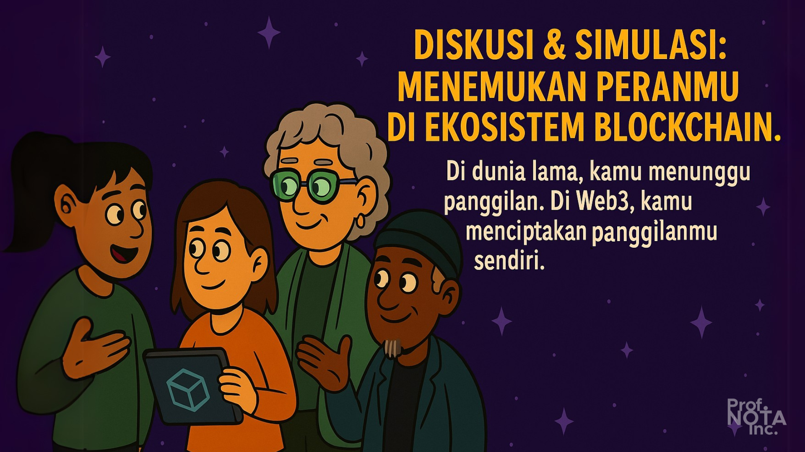
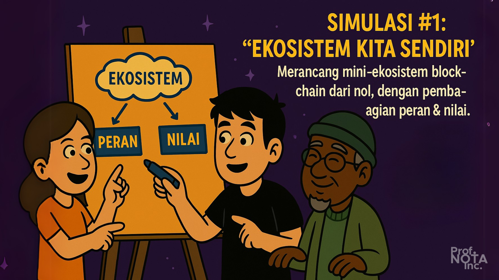
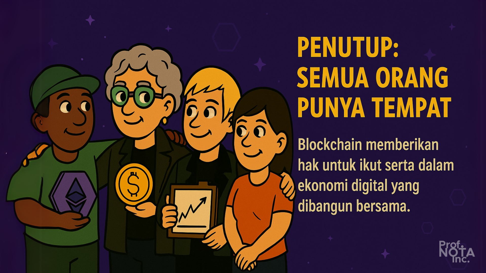
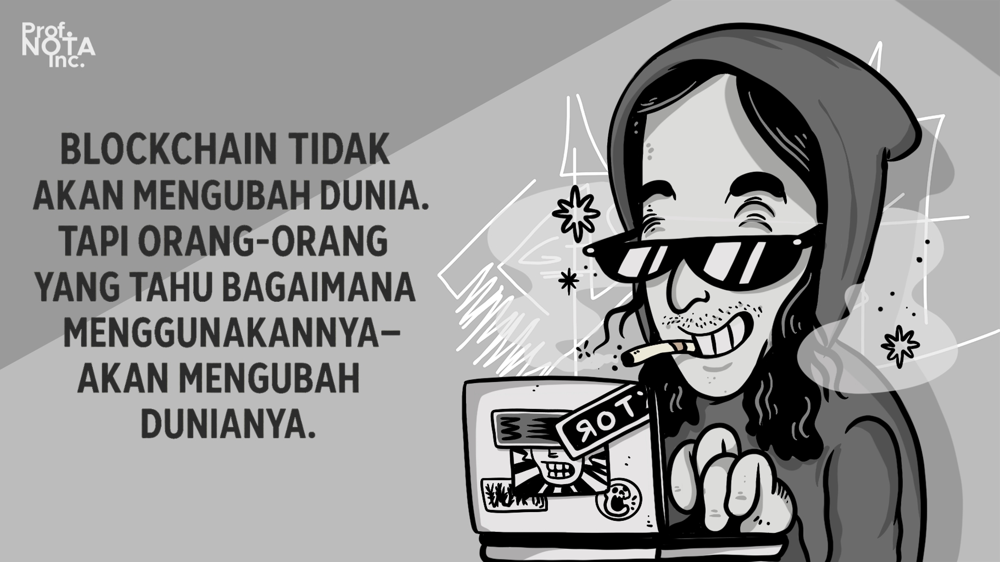
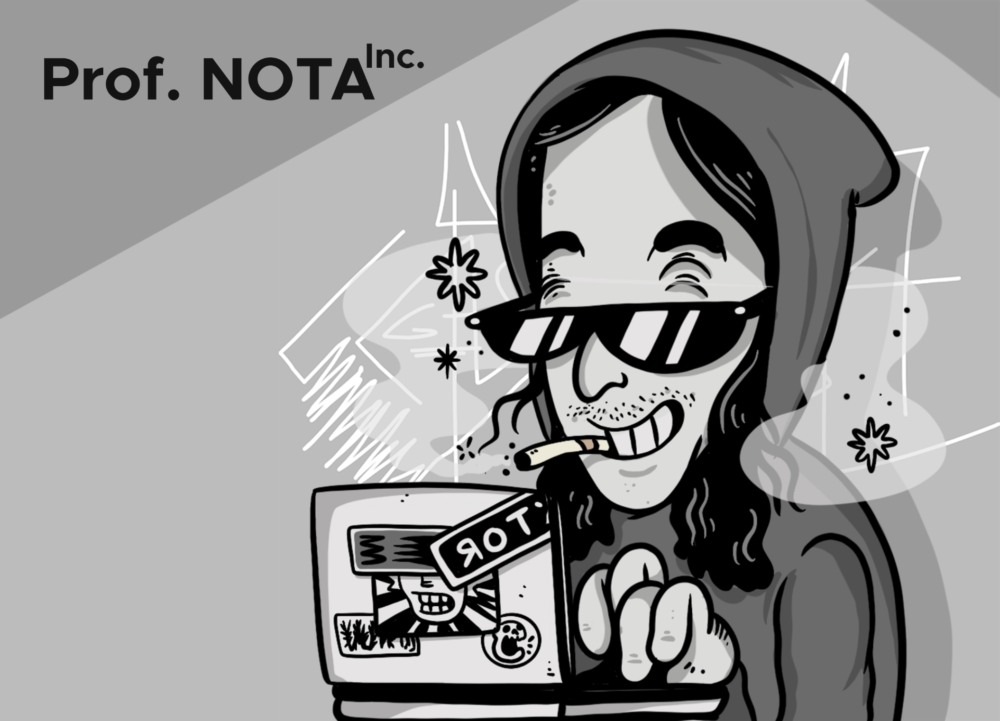

# 🔏 Bagian 06

> _“Pengetahuan hanya hidup jika kamu bawa ia berjalan.”_
>
> – **Prof. NOTA**

Setelah menyelami struktur ekonomi blockchain, berbagai peran, studi kasus, hingga strategi bisnis Web3, kini saatnya **kamu mengambil posisi.**

Di dunia lama, kamu menunggu panggilan. Di Web3, **kamu menciptakan panggilanmu sendiri.**

Bagian ini adalah _panggung percobaan_ — tempat kita tidak takut salah, tapi belajar lewat aksi.

<figure><figcaption>
Diskusi &#x26; Simulasi: Menemukan Peranmu di Ekosistem Blockchain.
</figcaption></figure>

***

## 🎭 Simulasi #1: “Ekosistem Kita Sendiri”

### **Tujuan:**

Merancang mini-ekosistem blockchain dari nol, dengan pembagian peran & nilai

### **Langkah:**

1. Peserta dibagi dalam kelompok (2–3 orang)
2. Diberi 1 tema besar (misalnya: pertanian lokal, pendidikan, seni rakyat, kota metaverse)
3. Setiap kelompok:
   * Menentukan masalah nyata di masyarakat
   * Mendesain solusi berbasis blockchain
   * Menentukan peran masing-masing anggota:
     * Validator / teknikal
     * Developer / product
     * Community / edukasi
     * Governance / strategi token
     * Artist / storyteller
4. Menyusun peta insentif & distribusi token
5. Menyajikan dalam 3 menit pitch

### **Hasil yang diharapkan:**

* Peserta memahami struktur ekosistem
* Terlihat siapa cenderung ke mana: builder? facilitator? researcher? communicator?

> _“Web3 bukan soal ahli teknologi. Tapi soal orang-orang yang tahu di mana tempat mereka berdiri.”_
>
> – **Prof. NOTA**

<figure><figcaption>
Simulasi #1: “Ekosistem Kita Sendiri”
</figcaption></figure>

***

## 💬 Diskusi Terbuka: “Siapa Saya di Dunia Baru Ini?”

### **Pertanyaan reflektif untuk diskusi kelompok kecil atau journaling pribadi:**

1. Apa yang membuat saya tertarik pada Web3?
2. Apa kekuatan utama saya saat ini? (teknik, komunikasi, visual, strategi, organisasi?)
3. Dari peran-peran yang dijelaskan tadi, mana yang terasa paling cocok?
4. Apa dampak sosial atau budaya yang ingin saya ciptakan lewat Web3?
5. Siapa yang saya ingin ajak untuk membangun ini bersama?

<figure><figcaption>
Diskusi Terbuka: “Siapa Saya di Dunia Baru Ini?”
</figcaption></figure>

***

## 📄 Tugas Akhir: Draft Pitch Pribadi

> _“Jika kamu hanya punya 30 detik untuk mengenalkan dirimu di dunia Web3, kamu akan bicara apa?”_
>
> – **Prof. NOTA**

### Setiap peserta harus membuat draft narasi pendek:

* Siapa kamu?
* Masalah apa yang kamu lihat?
* Apa yang ingin kamu bangun?
* Bagaimana kamu akan memulainya?

Bisa dibagikan di forum online, atau disimpan sebagai dokumen refleksi.

<figure><figcaption>
Tugas Akhir: Draft Pitch Pribadi
</figcaption></figure>

***

## 🧩 Penutup: Semua Orang Punya Tempat

> _“Dunia blockchain bukan untuk semuanya. Tapi di dalamnya, semua orang bisa punya tempat.”_
>
> – **Prof. NOTA**

Materi ini bukan tentang menjadikan semua orang sebagai developer. Bukan pula tentang memaksa semua orang menjadi DAO founder.

Materi ini tentang **memberikan hak untuk ikut serta** dalam ekonomi digital yang dibangun bersama.

Karena sistem yang adil tidak datang dari satu tangan—ia datang dari banyak tangan yang saling percaya.

Dan kamu, yang telah membaca materi ini, kamu telah menyentuh tangan-tangan itu—dan sedang bersiap jadi salah satu penggeraknya.

<figure><figcaption>
Penutup: Semua Orang Punya Tempat
</figcaption></figure>

***

## 🔚 Penutup Akhir dari Prof. NOTA

> _“Blockchain tidak akan mengubah dunia. Tapi orang-orang yang tahu bagaimana menggunakannya—akan mengubah dunianya.”_
>
> – **Prof. NOTA**

<figure><figcaption>
Penutup Akhir dari Prof. NOTA
</figcaption></figure>

***

📌 _Disusun oleh Prof. NOTA Inc., sebagai bagian dari upaya literasi desentralisasi untuk semua generasi._

<figure><figcaption>
Prof. NOTA Inc.
</figcaption></figure>

Seperti biasanya dan yang sudah-sudah… mohon apa yang sudah disampaikan di materi ini dikonfirmasi dan divalidasi. Jika ternyata tidak valid, mohon diperbarui (di-update) agar [**Prof. NOTA**](https://nota.endhonesa.com/) bisa hadir dengan materi versi terbaru (high-end) di realitas kalian, kehidupan nyata kalian.

Sampai jumpa di materi berikutnya. Terima Kasih, #OiOi!

Salam,

[**Prof. NOTA**](https://nota.endhonesa.com/)\
\==== 47 =======

N.B. Semua materi edukasi ini selalu diperbarui dan telah digunakan dan disampaikan oleh [**Prof. NOTA**](https://nota.endhonesa.com/) di beberapa sesi di kelas, seminar, kuliah, dan workshop tentang **Web3**, baik secara online maupun offline, di antaranya adalah:

* [**IDNFT Academy #1 - April hingga Juni 2022**](https://www.instagram.com/idnftacademy/)
* [**Web3 on Campus: Petra Christian University Surabaya - 17 April 2023**](https://web3campus.idnft.id/)
* **BANANOW Land - Class NOW - Sepanjang 2022 - 2023**
* [**Road to DevCon Ethereum 2024: Halo Ethereum - 7 Desember 2023**](https://pintu.co.id/news/61828-pintu-sponsori-event-halo-ethereum)

N.B. 2. Jika kamu merasa materi ini bermanfaat, **bagikan kepada saudaramu, temanmu, komunitasmu, atau mereka yang sedang mencari cara baru untuk membangun nilainya sendiri**. Karena materi ini bukan hanya untuk kita yang membaca ini — tapi juga untuk mereka yang belum tahu.

***

P.S. Read this document freely for information and guidance. Do not redistribute or restate—no quotes, summaries, paraphrases, or derivatives—without prior written permission from [**Prof. NOTA**](https://nota.endhonesa.com/). Sharing the link is allowed. So, share the link, not the text. Do not discuss or re-tell the contents in any form—written, spoken, or recorded—without prior written permission.

***
